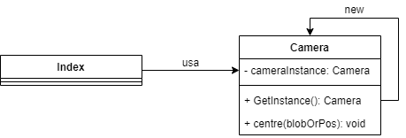

<h1>
    Integrantes
</h1>
<h2>
    Juan Camilo Guaba
    Wilmer Ricardo Pachón
</h2>
<h3>
    Patrones de diseño aplicado a juegos (AGAR.IO)
</h3>
<h4>
    Planteamiento del problema
</h4>
<p>
    Encontramos entonces varias incidencias que se presentan alrededor de este escenario, 
    partimos de la base de que el usuario necesitará para su desplazamiento por el escenario de juego 
    una visión de lo que se encuentra haciendo a través del tablero de juego, por lo que necesitará una instancia 
    y una única instancia de la misma
</p>
<h4>Singleton</h4>

<p>De esta manera vemos entonces como el patron singleton soluciona el inconveniente de instanciar 
    por unica vez la clase Camara, por que esta se usará una única vez dentro de el desarrollo del juego
</p>
<h4>Prototype</h4>
<p>
    Como hemos explorado en las diferentes clases, hemos encontrado que el patron prototipo nos permite crear nuevos objetos
    clonandolos de una instancia creada con anterioridad para lo que entonces clonamos los diferentes puntos ubicados 
    en el tablero de juego con el fin de que todos tengan caracteristicas similares y por su puesto actuen con las funcionalidades
    comunes  
</p>
```python
    def spawn_cells(self, cell,numOfCells):
        localCell = cell
        localCell.inicializar()
        for i in range(numOfCells):
            self.cell_list.append(localCell)
            localCell = copy.deepcopy(localCell)
            localCell.inicializar()
```

