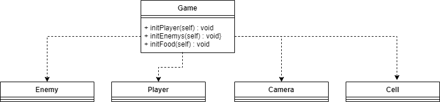

<h1>
    Integrantes
</h1>
<h2>
    Juan Camilo Guaba
    Wilmer Ricardo Pachón
</h2>
<h3>
    Patrones de diseño aplicado a juegos (AGAR.IO)
</h3>
<h4>
    Planteamiento del problema
</h4>

    Encontramos entonces varias incidencias que se presentan alrededor de este escenario, 
    partimos de la base de que el usuario necesitará para su desplazamiento por el escenario de juego 
    una visión de lo que se encuentra haciendo a través del tablero de juego, por lo que necesitará una instancia 
    y una única instancia de la misma

<h4>Singleton</h4>

De esta manera vemos entonces como el patron singleton soluciona el inconveniente de instanciar 
    por unica vez la clase Camara, por que esta se usará una única vez dentro de el desarrollo del juego

<h4>Prototype</h4>

    Como hemos explorado en las diferentes clases, hemos encontrado que el patron prototipo nos permite crear nuevos objetos
    clonandolos de una instancia creada con anterioridad para lo que entonces clonamos los diferentes puntos ubicados 
    en el tablero de juego con el fin de que todos tengan caracteristicas similares y por su puesto actuen con las funcionalidades
    comunes  

<code>
   def spawn_cells(self, cell,numOfCells):
</code>
 
<code>
localCell = cell
</code>
 
<code>
localCell.inicializar()
</code>
 
<code>
for i in range(numOfCells):
</code>
 
<code>
    self.cell_list.append(localCell)
    </code>
 
<code>
    localCell = copy.deepcopy(localCell)
    </code>
 
<code>
    localCell.inicializar()     
</code>
 <h4>Facade</h4>

  Para la implementacion de el patron fachada partimos entonces de la situación que este desarrollo se encuentra separados por componentes especializados, que a su vez necesitan un orquestador que los llame y haga uso de ellos, tanto de sus atributos como de sus funcionalidades , en este caso la clase game, se encarga de hacer el llamado y uso de estas clases , instanciando dentro de sus métodos las clases necesarias , además de ello se hace una llama a game desde init.py que al final es lo unico que se llama para hacer uso del conjunto de funcionalidades del programa

